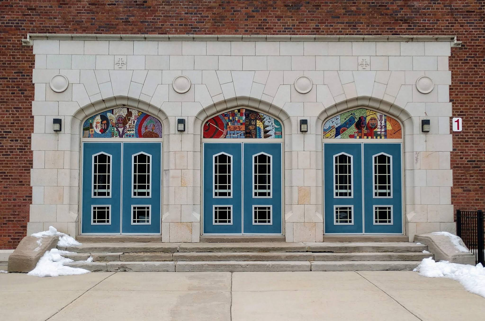
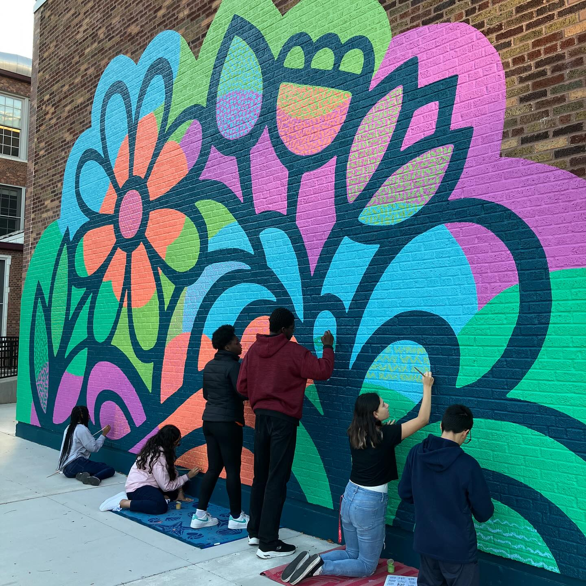
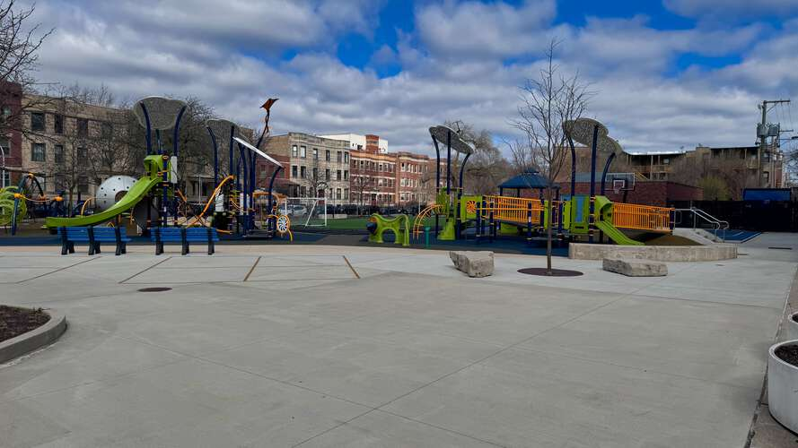

# About Friends of Courtenay

Friends of Courtenay is a non-profit organization (501c3 pending) made up of parents, caregivers, alumni, and community members who support the mission and vision of [Mary E. Courtenay Language Arts Center](https://courtenay.cps.edu/).

## How do we spend donations?

Friends of Courtenay is entirely volunteer-run, there is no paid staff or overhead.

Right now we're raising money for immediate *Equity & Essentials* such as grocery gift cards to cover SNAP shortages, but our goal is to build the kind of sustainable funding that lets Courtenay students enjoy the same enrichment, arts, and after-school opportunities as students at neighboring schools. We're already consulting with the [local school council](https://www.courtenay.cps.edu/apps/pages/index.jsp?uREC_ID=412981&type=d) to identify needs and opportunities for support that align with Courtenay's [mission and vision](https://courtenay.cps.edu/apps/pages/index.jsp?uREC_ID=412940&type=d).

## A history of community support

Courtenay families and neighbors have a strong track record of coming together to support the school. The most recent example is [A Play Space For All](https://www.aplayspaceforall.com/), where the old blacktop was transformed into a space where every child can play, regardless of physical ability.

We see this project's success as evidence of the long-standing demand and energy in the community to support the school's vision of an inclusive learning environment.

<!-- Playground video — edit in docs/_includes/playground-video.html -->
--8<-- "playground-video.html"

  
  
## Support the students

Every gift makes a difference for the students at Courtenay.

[Donate to Friends of Courtenay](https://19aid.com/courtenay-elementary-school-families-need-your-support/){ .md-button .md-button--primary }

<!-- Newsletter form — edit in docs/_includes/newsletter-section.md -->
--8<-- "newsletter-section.md"
