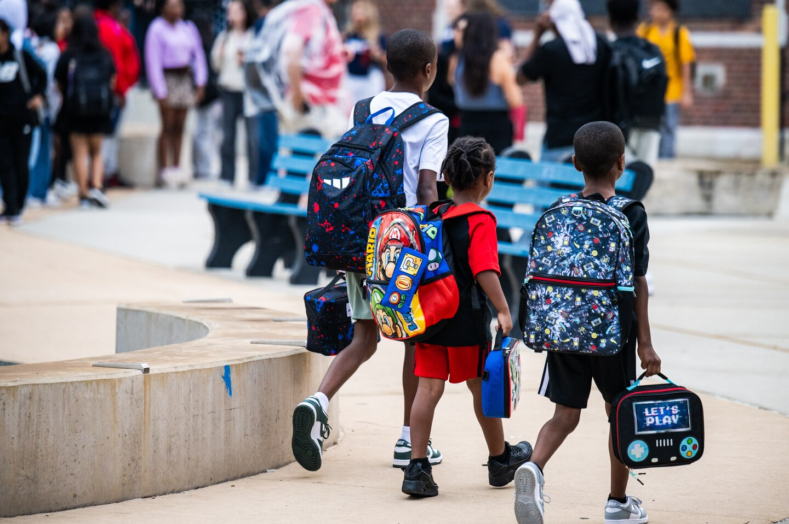

# Welcome to Friends of Courtenay! { .center-title }

Friends of Courtenay is a non-profit organization made up of parents, caregivers, alumni, and community members who support the mission and vision of [Mary E. Courtenay Language Arts Center](https://courtenay.cps.edu/). 

Our focus is on fundraising to support the school, making sure every young person in Uptown has access to a joyful learning experience.

[Learn more about us](about.md "About Friends of Courtenay"){ .md-button .md-button--primary }
[Make a donation](donate.md "Make a donation to Friends of Courtenay"){ .md-button .md-button--secondary }
[Volunteer](https://www.cps.edu/services-and-supports/parent-engagement/volunteer-programs/ "Volunteer with CPS"){ .md-button }

---

## Get involved {#get-involved}

If you’d like to get more involved with Friends of Courtenay, we’d love to hear from you. We’re always looking for new volunteers, classroom reps, and local partners who want to support our school community.

[Learn about CPS volunteer programs](https://www.cps.edu/services-and-supports/parent-engagement/volunteer-programs/ "Volunteer with CPS"){ .md-button .md-button--secondary }

[Email us](mailto:friendsofcourtenay@example.org "Email Friends of Courtenay"){ .md-button }
[Join our interest list](#connect "Join our interest list"){ .md-button .md-button--primary }

---

## About Courtenay

Courtenay Language Arts Center is a welcoming neighborhood school that centers joyful, rigorous learning and strong relationships between students, staff, and families. Friends of Courtenay partners with the school to help fund experiences and resources that public funding alone can’t cover.

[Read more about Courtenay and Friends of Courtenay](about.md){ .md-button .md-button--primary }

---

## Our work

We focus our efforts on projects that directly benefit students, teachers, and families.

- :lucide-book-open: **Enriching classrooms & spaces**  
  We help create warm, vibrant learning environments – from classroom libraries and flexible seating to welcoming hallways and outdoor spaces.

- :lucide-map: **Student enrichment & field trips**  
  We support experiences beyond the classroom like field trips, visiting artists, clubs, and after‑school opportunities.

- :lucide-users: **Family & community events**  
  We fund and organize family nights, celebrations, and school‑wide events that bring our community together.

- :lucide-award: **Teacher & staff appreciation**  
  We show gratitude to teachers and staff through appreciation events, small stipends, and classroom mini‑grants.

- :lucide-heart-handshake: **Equity & basic needs**  
  We help cover supplies, fees, and other essentials so that all students can participate fully, regardless of family income.

- :lucide-flask-conical: **STEAM & arts opportunities**  
  We invest in hands‑on science, technology, engineering, arts, and math projects that spark curiosity and creativity.

 by Alec Rudek")

---

## Donate {#donate}

Your support helps us fund the programs and experiences that make Courtenay special. Every contribution — big or small — goes directly toward students and classrooms.

[Make a tax‑deductible donation](donate.md){ .md-button .md-button--primary }

If your business would like to partner with Friends of Courtenay, we’d love to talk.

[Become a business partner](mailto:friendsofcourtenay@example.org?subject=Business%20partnership){ .md-button .md-button--secondary }

---

## Connect {#connect}

Stay in the loop about what’s happening at Courtenay and how you can help.

Sign up to receive occasional updates about events, volunteer opportunities, and funding priorities.

[Sign up for our newsletter](https://example.com/newsletter "Postmark newsletter link"){ .md-button .md-button--primary }

- **Courtenay school Instagram**: [@courtenaylatigers](https://www.instagram.com/courtenaylatigers/ "Courtenay Language Arts Center on Instagram")
- **Friends of Courtenay email**: `friendsofcourtenay@example.org`

