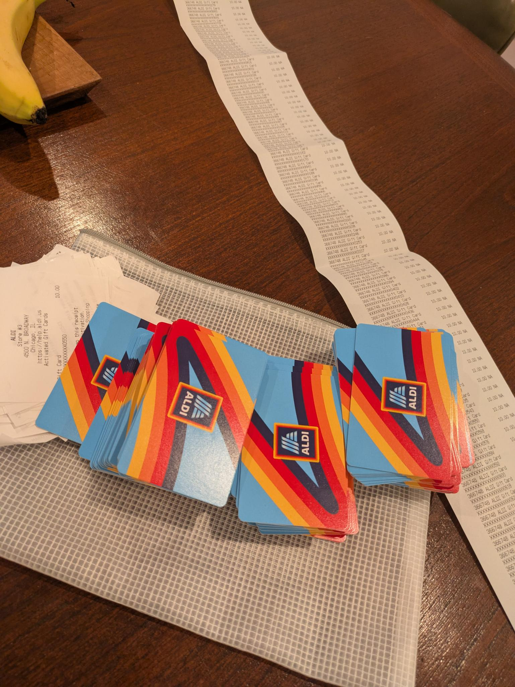

# Welcome, Friends of Courtenay! { .center-title .courtenay-headline }
<!-- Logo and welcome banner — edit in docs/_includes/header.md -->
--8<-- "header.md"

[Mary E. Courtenay Language Arts Center](https://courtenay.cps.edu/) in Uptown offers pre-K through 8th education. If you've been in or around Courtenay recently, you've seen the abundant community support. Yet like many neighborhood schools, Courtenay is under-resourced. Friends of Courtenay aims to fund programs and materials to help teachers and staff to invest in the rich potential and exuberance in every child.

*Friends of Courtenay* is a nonprofit organization made up of caregivers, alumni, community members, and local partners who invest in the school's academic [mission and vision](https://courtenay.cps.edu/apps/pages/index.jsp?uREC_ID=412940&type=d), so every young neighbor in Uptown has a joyful learning experience.

")

---

<!-- Donation buttons — edit in docs/_includes/cta-section.md -->
--8<-- "cta-section.md"
---

{ .responsive-right-img }
## Food Aid

Need help with groceries? Pick up a $20 Aldi's giftcard at the [Uptown Library](https://www.chipublib.org/locations/70/) -- just ask at the Reference Desk and mention *Friends of Courtenay*. 

If you'd instead like to pick up the card at Aldi's (4500 N. Broadway), please fill out the form below and someone from *Friends of Courtenay* will meet you near the entrance to the store.

??? abstract "Aldi pickup form"

    --8<-- "food-aid-form.html"

[Email Friends of Courtenay](mailto:FriendsOfCourtenay@proton.me){ .md-button .md-button--secondary }

---

## Know Your Rights Workshop

Learn how to protect yourself and your community during encounters with immigration or law enforcement. This workshop will cover our fundamental rights, how to assert them safely, and where to find trusted resources and support.

[Register on Zoom](https://zoom.us/webinar/register/WN_RMVZEb4lTtyquvNqxrCBWw#/registration){ .md-button .md-button--primary }

_Credit: [ICIRR / FSN](https://www.icirr.org/fsn)_

---

<!-- Newsletter form — edit in docs/_includes/newsletter-section.md -->
--8<-- "newsletter-section.md"

---

<!-- School news feed — edit in docs/_includes/news-feed.md -->
--8<-- "news-feed.md"
