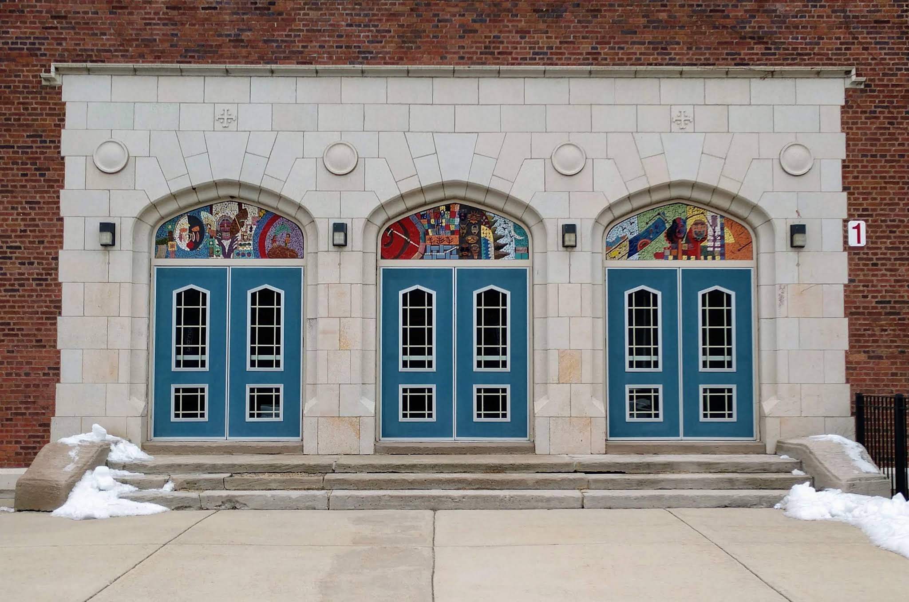

# عن أصدقاء كورتني

أصدقاء كورتني (Friends of Courtenay) هي منظمة غير ربحية (بانتظار الموافقة على وضع 501c3) تتكون من أولياء الأمور، ومقدمي الرعاية، والخريجين، وأفراد المجتمع الذين يدعمون مهمة ورؤية [مركز ماري إي كورتني لفنون اللغة](https://courtenay.cps.edu/).

## كيف ننفق التبرعات؟

تدار منظمة أصدقاء كورتني بالكامل من قبل متطوعين، ولا يوجد موظفون بأجر أو مصاريف إدارية.

حالياً، نحن نجمع الأموال من أجل *الأساسيات والمساواة* العاجلة مثل بطاقات هدايا البقالة لتغطية نقص برنامج SNAP، ولكن هدفنا هو بناء نوع من التمويل المستدام الذي يتيح لطلاب كورتني الاستمتاع بنفس الفرص الإثرائية والفنية وأنشطة ما بعد المدرسة التي يتمتع بها الطلاب في المدارس المجاورة. نحن نتشاور بالفعل مع [مجلس المدرسة المحلي](https://www.courtenay.cps.edu/apps/pages/index.jsp?uREC_ID=412981&type=d) لتحديد الاحتياجات وفرص الدعم التي تتماشى مع [مهمة ورؤية](https://courtenay.cps.edu/apps/pages/index.jsp?uREC_ID=412940&type=d) كورتني.

## تاريخ من الدعم المجتمعي

لدى عائلات وجيران كورتني سجل حافل في التكاتف لدعم المدرسة. أحدث مثال هو [مساحة لعب للجميع](https://www.aplayspaceforall.com/)، حيث تم تحويل الفناء الأسفلت القديم إلى مساحة يمكن لكل طفل اللعب فيها، بغض النظر عن القدرة البدنية.

نرى نجاح هذا المشروع كدليل على الطلب المستمر والطاقة الموجودة في المجتمع لدعم رؤية المدرسة لبيئة تعليمية شاملة.

  <iframe
    width="560"
    height="315"
    src="https://www.youtube.com/embed/-iYjw4GpGZ8"
    title="فيديو مساحة لعب للجميع"
    frameborder="0"
    allow="accelerometer; autoplay; clipboard-write; encrypted-media; gyroscope; picture-in-picture; web-share"
    referrerpolicy="strict-origin-when-cross-origin"
    allowfullscreen>
  </iframe>

  
  
## ادعم الطلاب

كل هدية تحدث فرقاً لطلاب كورتني.

[تبرع لأصدقاء كورتني](https://19aid.com/courtenay-elementary-school-families-need-your-support/){ .md-button .md-button--primary }

## النشرة الإخبارية :lucide-mail: {.courtenay-headline}

انضم للنشرة الإخبارية. نرسل تحديثات من حين لآخر، ليس أكثر من مرة في الشهر.

<form action="https://www.friendsofcourtenay.org/api/subscribe" method="POST" class="newsletter-form">
  <input type="text" name="name" id="newsletter-name" placeholder="الاسم" autocomplete="name" />
  <input type="email" name="email" id="newsletter-email" placeholder="البريد الإلكتروني" autocomplete="email" required />

  

  <button type="submit" class="md-button md-button--secondary">
    اشترك في نشرتنا
  </button>
</form>

