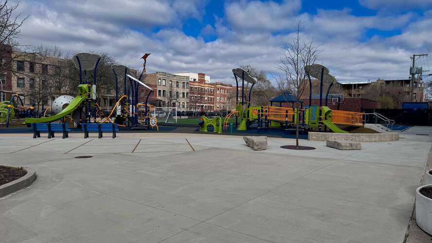

# Sobre Amigos de Courtenay

Amigos de Courtenay (Friends of Courtenay) es una organización sin fines de lucro (estatus 501c3 pendiente) formada por padres, cuidadores, exalumnos y miembros de la comunidad que apoyan la misión y visión del [Mary E. Courtenay Language Arts Center](https://courtenay.cps.edu/).

## ¿Cómo gastamos las donaciones?

Amigos de Courtenay está gestionado totalmente por voluntarios, no hay personal remunerado ni gastos generales.

En este momento estamos recaudando dinero para *Equidad y Necesidades Básicas* inmediatas, como tarjetas de regalo de supermercado para cubrir la escasez de SNAP, pero nuestro objetivo es construir el tipo de financiamiento sostenible que permita a los estudiantes de Courtenay disfrutar de las mismas oportunidades de enriquecimiento, artes y actividades extracurriculares que los estudiantes de las escuelas vecinas. Ya estamos consultando con el [consejo escolar local](https://www.courtenay.cps.edu/apps/pages/index.jsp?uREC_ID=412981&type=d) para identificar necesidades y oportunidades de apoyo que se alineen con la [misión y visión](https://courtenay.cps.edu/apps/pages/index.jsp?uREC_ID=412940&type=d) de Courtenay.

## Una historia de apoyo comunitario

Las familias y vecinos de Courtenay tienen un sólido historial de unirse para apoyar a la escuela. El ejemplo más reciente es [A Play Space For All](https://www.aplayspaceforall.com/) (Un Espacio de Juego para Todos), donde el antiguo asfalto se transformó en un espacio donde cada niño puede jugar, independientemente de su capacidad física.

Vemos el éxito de este proyecto como evidencia de la demanda y energía duraderas en la comunidad para apoyar la visión de la escuela de un entorno de aprendizaje inclusivo.

  <iframe
    width="560"
    height="315"
    src="https://www.youtube.com/embed/-iYjw4GpGZ8"
    title="Video de UN ESPACIO DE JUEGO PARA TODOS"
    frameborder="0"
    allow="accelerometer; autoplay; clipboard-write; encrypted-media; gyroscope; picture-in-picture; web-share"
    referrerpolicy="strict-origin-when-cross-origin"
    allowfullscreen>
  </iframe>

  
  
## Apoya a los estudiantes

Cada regalo hace una diferencia para los estudiantes de Courtenay.

[Dona a Amigos de Courtenay](https://19aid.com/courtenay-elementary-school-families-need-your-support/){ .md-button .md-button--primary }

## Boletín :lucide-mail: {.courtenay-headline}

Únete al boletín. Enviamos actualizaciones ocasionales, no más de una vez al mes.

<form action="https://www.friendsofcourtenay.org/api/subscribe" method="POST" class="newsletter-form">
  <input type="text" name="name" id="newsletter-name" placeholder="Nombre" autocomplete="name" />
  <input type="email" name="email" id="newsletter-email" placeholder="Correo electrónico" autocomplete="email" required />

  

  <button type="submit" class="md-button md-button--secondary">
    Únete a nuestro boletín
  </button>
</form>

