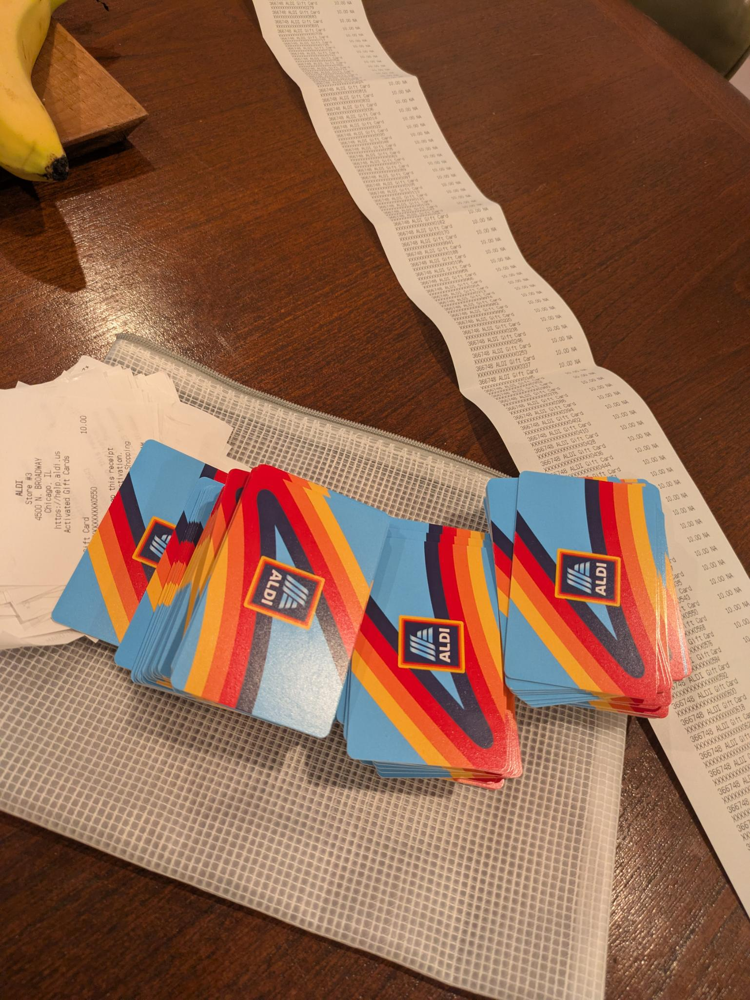

# ¡Bienvenidos, Amigos de Courtenay! { .center-title .courtenay-headline }

{width="120"}

!!! info "¡Bienvenidos! [Friends](/) · [Amis](/fr/) · [Bạn bè](/vi/) · [朋友](/zh/) · [أصدقاء](/ar/) · [Друзі](/uk/)"

{ .responsive-right-img }
## Ayuda alimentaria

Si tu hijo/a asiste a la primaria Courtenay y necesitas ayuda con la compra de alimentos, menciona "Friends of Courtenay" al Sr. Weathersby (quizás lo reconozcas como el guardia de seguridad de la escuela) después de clases en Dover St para recibir una tarjeta de regalo de Aldi de $20.

[Apoya este esfuerzo](https://19aid.com/courtenay-elementary-school-families-need-your-support/){ .md-button .md-button--primary } [Envía un correo a Amigos de Courtenay](mailto:FriendsOfCourtenay@proton.me){ .md-button .md-button--secondary }

---

## Taller: Conoce Tus Derechos

Aprende cómo protegerte a ti mismo y a tu comunidad durante encuentros con agentes de inmigración o agentes federales. Este taller cubrirá nuestros derechos fundamentales, cómo ejercerlos de manera segura y dónde encontrar recursos y apoyos de confianza.

[Regístrate en Zoom](https://zoom.us/webinar/register/WN_RMVZEb4lTtyquvNqxrCBWw#/registration){ .md-button .md-button--primary }

_Crédito: [ICIRR / FSN](https://www.icirr.org/fsn)_

---

## ¡Muestra orgullo por tus Tigres de Courtenay! :lucide-paw-print: {.courtenay-headline}  
  
[Haz una donación](https://19aid.com/courtenay-elementary-school-families-need-your-support/ "Haz una donación a Amigos de Courtenay"){ .md-button .md-button--primary }
[Conócenos](about.md "Sobre Amigos de Courtenay"){ .md-button .md-button--secondary }
[Hazte voluntario/a](https://www.cps.edu/services-and-supports/parent-engagement/volunteer-programs/ "Voluntariado con CPS"){ .md-button .md-button--secondary }

---

[Mary E. Courtenay Language Arts Center](https://courtenay.cps.edu/) en Uptown ofrece educación desde pre-K hasta 8.º grado. Si últimamente has pasado por Courtenay, habrás visto el gran apoyo de la comunidad. Sin embargo, como muchas escuelas del vecindario, Courtenay no cuenta con los recursos que necesita. Amigos de Courtenay busca financiar programas y materiales para ayudar a docentes y personal a impulsar el enorme potencial y la alegría de cada niño.

*Amigos de Courtenay (Friends of Courtenay)* es una organización sin fines de lucro formada por cuidadores, exalumnos, miembros de la comunidad y aliados locales que apoyan la [misión y visión](https://courtenay.cps.edu/apps/pages/index.jsp?uREC_ID=412940&type=d) de la escuela, para que cada estudiante de Uptown tenga una experiencia de aprendizaje plena y alegre.

")

---

## Boletín :lucide-mail: {.courtenay-headline}

Únete al boletín para recibir actualizaciones ocasionales.

<form action="https://www.friendsofcourtenay.org/api/subscribe" method="POST" class="newsletter-form">
  <input type="text" name="name" id="newsletter-name" placeholder="Nombre" autocomplete="name" />
  <input type="email" name="email" id="newsletter-email" placeholder="Correo electrónico" autocomplete="email" required />

  

  <button type="submit" class="md-button md-button--secondary">
    Suscríbete al boletín
  </button>
</form>

---

## Noticias de la escuela Courtenay :lucide-rss: {.courtenay-headline}
Cargando noticias de Courtenay Language Arts Center...

