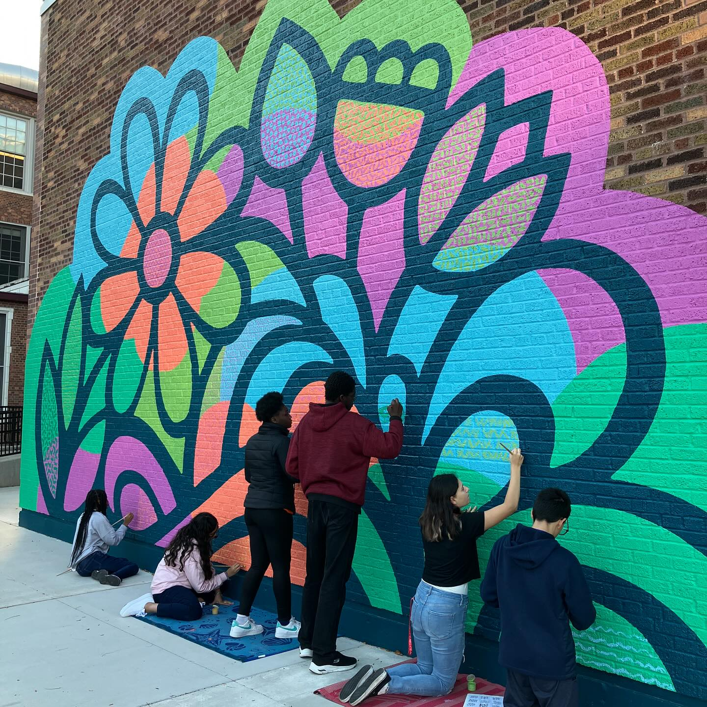

# À propos de Friends of Courtenay

Friends of Courtenay est une organisation à but non lucratif (statut 501(c)(3) en cours) composée de parents, de proches aidants, d’anciens élèves et de membres de la communauté qui soutiennent la mission et la vision du [Mary E. Courtenay Language Arts Center](https://courtenay.cps.edu/).

## Comment utilisons-nous les dons ?

Friends of Courtenay est géré entièrement par des bénévoles : il n’y a ni personnel salarié ni frais généraux.

En ce moment, nous recueillons des fonds pour répondre aux besoins immédiats en matière d’*Équité & essentiels* — par exemple des cartes‑cadeaux pour l’épicerie afin de compenser la baisse des aides alimentaires (SNAP) — mais notre objectif est de construire un financement pérenne qui permette aux élèves de Courtenay de bénéficier des mêmes activités d’enrichissement, d’arts et de programmes extrascolaires que les élèves des écoles voisines. Nous travaillons déjà avec le [conseil scolaire local](https://www.courtenay.cps.edu/apps/pages/index.jsp?uREC_ID=412981&type=d) pour identifier les besoins et les opportunités de soutien qui s’alignent sur la [mission et la vision](https://courtenay.cps.edu/apps/pages/index.jsp?uREC_ID=412940&type=d) de Courtenay.

## Une histoire de solidarité communautaire

Les familles de Courtenay et les voisins ont une longue tradition de mobilisation pour soutenir l’école. Le plus récent exemple est [A Play Space For All](https://www.aplayspaceforall.com/), où l’ancienne cour en bitume a été transformée en un espace où chaque enfant peut jouer, quelles que soient ses capacités physiques.

Nous considérons le succès de ce projet comme la preuve de la demande et de l’énergie durables de la communauté pour soutenir la vision de l’école : un environnement d’apprentissage inclusif.

  <iframe
    width="560"
    height="315"
    src="https://www.youtube.com/embed/-iYjw4GpGZ8"
    title="A PLAY SPACE FOR ALL video"
    frameborder="0"
    allow="accelerometer; autoplay; clipboard-write; encrypted-media; gyroscope; picture-in-picture; web-share"
    referrerpolicy="strict-origin-when-cross-origin"
    allowfullscreen>
  </iframe>

  
  
## Soutenir les élèves

Chaque don, quel qu’en soit le montant, fait une différence pour les élèves de Courtenay.

[Faire un don à Friends of Courtenay](https://19aid.com/courtenay-elementary-school-families-need-your-support/){ .md-button .md-button--primary }

## Newsletter :lucide-mail: {.courtenay-headline}

Inscrivez-vous à notre newsletter. Nous envoyons des nouvelles de temps en temps, au maximum une fois par mois.

<form action="https://www.friendsofcourtenay.org/api/subscribe" method="POST" class="newsletter-form">
  <input type="text" name="name" id="newsletter-name" placeholder="Nom" autocomplete="name" />
  <input type="email" name="email" id="newsletter-email" placeholder="Adresse e‑mail" autocomplete="email" required />

  

  <button type="submit" class="md-button md-button--secondary">
    S’inscrire à la newsletter
  </button>
</form>

