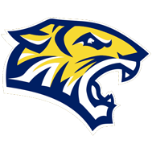

# Chào mừng Quý vị đến với Friends of Courtenay! { .center-title .courtenay-headline }

{width="120"}

!!! info "Chào mừng tất cả! [Amigos](/es/) · [Amis](/fr/) · [Friends](/) · [朋友](/zh/) · [أصدقاء](/ar/) · [Друзі](/uk/)"

{ .responsive-right-img }
## Hỗ trợ thực phẩm

Nếu con/em của Quý vị học tại trường tiểu học Courtenay và Quý vị cần hỗ trợ mua thực phẩm, vui lòng nhắc đến "Friends of Courtenay" với ông Weathersby (có thể Quý vị biết ông là nhân viên an ninh của trường) sau giờ học tại Dover St để nhận thẻ quà tặng ALDI trị giá 20 USD.

[Ủng hộ nỗ lực này](https://19aid.com/courtenay-elementary-school-families-need-your-support/){ .md-button .md-button--primary } [Liên hệ Friends of Courtenay](mailto:FriendsOfCourtenay@proton.me){ .md-button .md-button--secondary }

---

## Hội thảo: Hiểu rõ quyền của bạn

Tìm hiểu cách bảo vệ bản thân và cộng đồng trong các cuộc gặp với cơ quan di trú hoặc lực lượng thực thi pháp luật. Hội thảo sẽ đề cập đến các quyền cơ bản, cách khẳng định quyền một cách an toàn và nơi tìm các nguồn lực đáng tin cậy cùng hỗ trợ.

[Đăng ký trên Zoom](https://zoom.us/webinar/register/WN_RMVZEb4lTtyquvNqxrCBWw#/registration){ .md-button .md-button--primary }

_Ghi nhận: [ICIRR / FSN](https://www.icirr.org/fsn)_

---

## Cùng cổ vũ Courtenay Tigers! :lucide-paw-print: {.courtenay-headline}  
  
[Ủng hộ / tài trợ](https://19aid.com/courtenay-elementary-school-families-need-your-support/ "Ủng hộ Friends of Courtenay"){ .md-button .md-button--primary }
[Tìm hiểu thêm về chúng tôi](about.md "Về Friends of Courtenay"){ .md-button .md-button--secondary }
[Tình nguyện](https://www.cps.edu/services-and-supports/parent-engagement/volunteer-programs/ "Tình nguyện với CPS"){ .md-button .md-button--secondary }

---

[Trường Mary E. Courtenay Language Arts Center](https://courtenay.cps.edu/) ở Uptown dạy học sinh từ tiền mẫu giáo (Pre‑K) đến lớp 8. Nếu gần đây Quý vị có dịp ghé hoặc đi ngang Courtenay, hẳn Quý vị đã thấy sự ủng hộ mạnh mẽ từ cộng đồng. Tuy vậy, cũng như nhiều trường trong khu vực, Courtenay vẫn còn thiếu nguồn lực. Friends of Courtenay gây quỹ cho các chương trình và tài liệu học tập, giúp thầy cô và nhà trường nuôi dưỡng tiềm năng và niềm háo hức học tập của từng em nhỏ.

*Friends of Courtenay* là một tổ chức phi lợi nhuận gồm phụ huynh/người chăm sóc, cựu học sinh, thành viên cộng đồng và các đối tác địa phương. Chúng tôi đồng hành cùng [sứ mệnh và tầm nhìn](https://courtenay.cps.edu/apps/pages/index.jsp?uREC_ID=412940&type=d) học thuật của nhà trường, để mọi em nhỏ ở Uptown đều có trải nghiệm học tập đầy niềm vui.

")

---

## Bản tin :lucide-mail: {.courtenay-headline}

Đăng ký nhận bản tin để nhận cập nhật thỉnh thoảng (không thường xuyên).

<form action="https://www.friendsofcourtenay.org/api/subscribe" method="POST" class="newsletter-form">
  <input type="text" name="name" id="newsletter-name" placeholder="Tên" autocomplete="name" />
  <input type="email" name="email" id="newsletter-email" placeholder="Địa chỉ email" autocomplete="email" required />

  

  <button type="submit" class="md-button md-button--secondary">
    Tham gia bản tin của chúng tôi
  </button>
</form>

---

## Tin tức Trường Courtenay :lucide-rss: {.courtenay-headline}
Đang tải tin tức từ Trung tâm Nghệ thuật Ngôn ngữ Courtenay...

